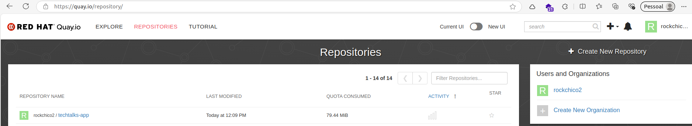
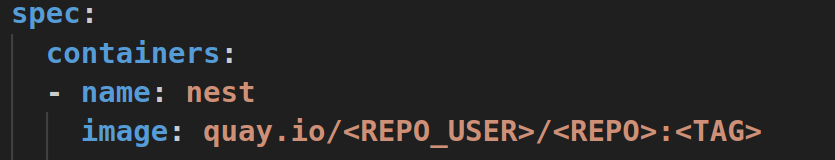

# Requisitos

- [Docker](https://docs.docker.com/desktop/install/windows-install/)
- [Kubectl](https://kubernetes.io/docs/tasks/tools/install-kubectl-windows/)
- Cluster Kubernetes


## Criar repositório no registro quay



## Login no registro
```sh
docker login quay.io
```

## Build

> substituir \<REPO_USER\> e \<REPO\> pelo usuário e repositório criados no registro quay
> <TAG> identifica a versão da imagem

```sh
docker build -f ./ci/Dockerfile ./ci -t quay.io/<REPO_USER>/<REPO>:<TAG>
```

## Rodar o container localmente e verificar se ele está iniciando a aplicação

```sh
docker run -it -p 3000:3000 quay.io/<REPO_USER>/<REPO>:<TAG>
```

## Push da imagem pro registro 

```sh
docker push quay.io/<REPO_USER>/<REPO>:<TAG>
```

## Deploy no cluster kubernetes

> configurar repositório da imagem  no arquivo cd/manifests/deploy.yml



> aplicar no cluster k8s

```sh
kubeclt apply -f cd/manifests/deploy.yml
```


